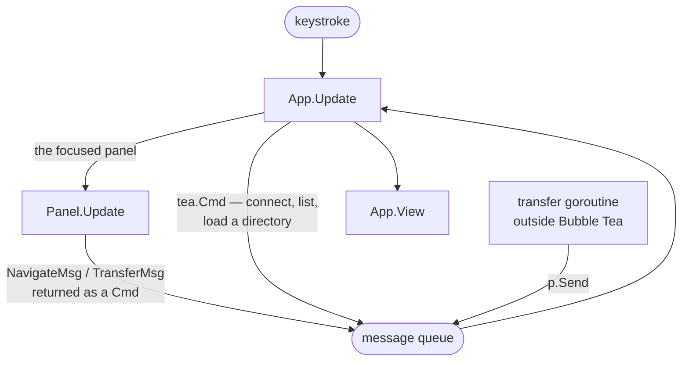
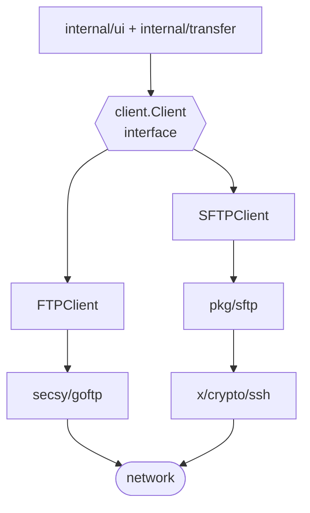

# Architecture

How lazyftp is put together, for anyone changing it.

The first two sections are the map and are worth reading before any change. The last one says
how to build and test it. The three in between — the client package, the rules, the traps — matter
once you touch the network or the update loop, and can wait until you do.

[style.md](style.md) is the companion to this one: it covers what the patch itself should look
like, where this covers where it goes.

## The shape of the program

lazyftp moves files between the local machine and a server, from the keyboard. It is a single
binary with no daemon; named connection profiles are the only persistent application state.

Six packages, all under `internal/` because none of them is meant to be imported by anything
else:

| Package | Holds | Depends on |
|---|---|---|
| `ui` | The screen and every keystroke. The `App` model, the panels, the connection bar | `client`, `config`, `transfer`, `model`, `shared` |
| `client` | Reaching servers. The `Client` interface and its FTP/FTPS and SFTP implementations | `model`, `shared` |
| `config` | Versioned saved-connection profile file and its permission-restricted atomic writes | nothing |
| `transfer` | Running uploads and downloads in the background, reporting progress | `client`, `model`, `shared` |
| `model` | `FileInfo` — one entry in a listing, local or remote, with the same shape either way | nothing |
| `shared` | Types that would otherwise cause an import cycle: messages, the progress wrappers, `LineBuffer` | nothing |

`shared` is not a utility drawer. It exists because `transfer` sends messages that `ui` consumes,
and `ui` starts transfers: putting the messages in either package makes the two import each other.
If something belongs to one package, it goes in that package.

### Where things are

`main.go` (63 lines) parses the flags, opens the log file if asked, and starts the program. It
holds no logic worth reading twice.

Inside `ui`, `app.go` is the largest file in the project and the one to read first: it holds the
model, the message dispatch, the layout arithmetic and the handlers. `panel.go` is the file
browser used for both sides. `connectionbar.go` is the form at the top. `processes.go` and
`log.go` are the two bottom panels. `helpers.go` draws the borders everything else sits inside.

Inside `client`, `client.go` declares the interface and the dial timeout, `protocol.go` holds the
protocol type and the factory, and `ftp.go` and `sftp.go` are the two implementations at roughly
two hundred lines each. `internal/config/config.go` owns the versioned JSON profile format and
writes it atomically outside the UI update loop.

### Where to make a change

- **A key binding or something on screen** → `internal/ui`, usually `panel.go` or `app.go`.
- **Something a server must do that it cannot do today** → add it to the `Client` interface in
  `client.go` and implement it twice, in `ftp.go` and `sftp.go`. The compiler will find every
  caller; there is no dynamic dispatch to chase.
- **How a transfer runs** → `internal/transfer/manager.go`.
- **A new field on a listed file** → `internal/model/file.go`, then populate it in both clients
  and in `ui/local.go` for the local side.

### One thing that is not obvious

There is no separate model layer between the UI and the network. `App` holds a `client.Client`
directly and calls it. For a program of this size that is deliberate: the interface is the seam
that keeps them apart, and adding a layer between them would buy indirection rather than
isolation.

## From a keystroke to a transfer

lazyftp is a Bubble Tea program, which means the whole application is one value. `App` in
`internal/ui/app.go` is the only `tea.Model`: it holds every piece of state, `Update` returns a
new `App` for each message that arrives, and `View` draws the screen from whatever `App` currently
holds. Nothing draws itself and nothing mutates in place.

The panels — `Panel`, `ConnectionBar`, `ProcessesPanel`, `LogPanel` — look like models and have
`Update` and `View` methods, but they are not registered with Bubble Tea and never receive a
message on their own. `App` passes messages down to them and stores what they return. They are a
way of splitting one large `Update` into readable pieces, not independent components.



`App.Update` reads a message in two passes. First a type switch handles the messages that concern
the application as a whole — window resizes, global keys, connection results, directory listings —
and returns early. Whatever survives that switch falls through to the bottom, where it is handed
to the panel that currently has focus. A key that means something globally is therefore handled
before any panel can see it, which is why `Ctrl+L` works from anywhere.

**Panels do not act, they state an intention.** When you press `Enter` on a directory,
`Panel.Update` does not list anything: it returns a command that produces a `NavigateMsg` naming
the panel and the path. `App` receives that message and decides what it means — a local
navigation reads the filesystem, a remote one calls the client, and neither happens if there is no
connection. The panel does not know which side it is on beyond a `local` flag, and knows nothing
about clients at all. `TransferMsg` is the same shape: marking files and pressing the transfer key
produces a message naming the source panel and the files, which `App` hands to the transfer
manager.

Messages that cross a package boundary live in `internal/shared/messages.go`; the transfer manager
runs in its own package and needs to reach the UI, so its messages live there. Everything else is
declared where it is produced — `ConnectMsg` in `connectionbar.go`, `NavigateMsg` in `panel.go`.
The export status of the UI's own messages carries no meaning: `connectedMsg` is unexported and
`NavigateMsg` is exported, yet neither is used outside `internal/ui`. That inconsistency is
historical. New UI-only messages should be unexported.

### Two ways to leave the update loop

Anything slow has to run somewhere else, and there are two mechanisms with different rules:

| | `tea.Cmd` | bare goroutine |
|---|---|---|
| Started by | returning it from `Update` | `go` in `transfer.Manager` |
| Owned by | Bubble Tea | us |
| On panic | recovered, terminal restored | kills the process unless we recover |
| Delivers by | returning a `Msg` | calling `p.Send` |
| Used for | connecting, listing, loading a directory | file transfers |

A command is the default and the safer one. Transfers are the exception: they report progress many
times over a long period rather than returning a single result, so they run as goroutines and push
messages in. That is also why `transfer.Manager` installs its own `recover` — Bubble Tea's does
not reach code it did not start. Several commands can be started at once with `tea.Batch`.

### The things that bite

**`p.Send` blocks.** Bubble Tea's message channel is created with `make(chan Msg)`, with no
buffer, so a send waits until the loop is free to receive. Send a message from inside `Update` and
it waits for an `Update` that cannot finish.

That is not hypothetical: goftp writes its control dialogue while a call is in progress, and those
calls used to happen inside `Update`. Turning each log line into a message would have deadlocked
the program. `shared.LineBuffer` exists for that — an `io.Writer` that parks complete lines under a
mutex until someone collects them. `App.drainProtoLog` collects them at the top of every `Update`,
where sending is safe.

Which raises the second point: **the drain only runs when a message arrives.** During a connection
attempt nothing would arrive for ten seconds, and the dialogue would appear all at once at the end.
The spinner's tick is what keeps `Update` running while an attempt is in flight, so the log fills
as it happens. The spinner is not only decoration.

**`program` is a function, not a `*tea.Program`.** `App` needs the program to push messages from
transfer goroutines, but the program is built from the model, so neither exists before the other.
`main.go` closes over a variable that is filled in immediately afterwards:

```go
var p *tea.Program
app := ui.NewApp(func() *tea.Program { return p }, *verbose, logWriter, version, *highlightDiff)
p = tea.NewProgram(app)
```

Callers must therefore expect `nil` until the program is running, which is what the `p == nil`
guards in `transfer.Manager` are for — and what lets tests construct an `App` with no program at
all.

### Where state lives

`App` holds the client, the transfer manager, the focus and the connection status. The current
directory of each side lives in `Panel.path`, not in the client — the client is told which path to
list on every call and keeps no notion of where the user is. Selection and marks live in the panel
that owns them.

Connection attempts carry a number. `App.connectSeq` is incremented when an attempt starts and
again when `Esc` abandons one, and the result carries the number it was started with. A result
whose number no longer matches is dropped and its connection closed, which is what stops an
abandoned attempt from connecting the application after the user has moved on.

### Adding to the loop

- **A key that only affects one panel** goes in that panel's `Update`. If it needs the application
  to do something, return a command producing a message rather than reaching outward.
- **A global key** goes in the type switch in `App.Update`, before the fall-through.
- **A new message** goes in the file that produces it, unexported, unless it has to cross a package
  boundary — then it belongs in `internal/shared`.

## Talking to servers

Everything that reaches a server goes through one interface, `client.Client` in
`internal/client/client.go`. It declares what lazyftp needs a server to do — connect and
disconnect, list a directory, upload, download, make a directory, rename, delete — and nothing
else. `Connect` takes a `ConnectionOptions` value so protocol-specific authentication can be added
without growing a positional-argument list. Paths are plain strings, listings come back as
`[]model.FileInfo`, and progress is reported through a `func(int64)` callback that fires as bytes
move.

Two types implement it. `FTPClient` speaks FTP and FTPS, which are the same protocol with TLS
negotiated on top, so one type covers both with a `tls` field deciding whether to negotiate.
`SFTPClient` speaks SFTP, which is not FTP at all: it is a subsystem running over an SSH
connection, and it needs two libraries stacked to get there.



`client.New(protocol, logger)` maps a protocol to an implementation and returns the interface, so
the application holds a `Client` and never a concrete type. The individual constructors are
exported as well, but going through `New` is what keeps the choice in one place. The protocol comes from the
user's choice in the connection bar, never from the port: a server is free to sit on a
non-standard port, and guessing from the port is what made plain FTP unreachable before v0.1.2.
Adding a fourth protocol means a constant in `Protocol`, an entry in `protocolNames`, a case in
`New`, and a default port — the connection bar picks it up on its own.

That interface is also what makes the rest of the program testable. A struct returning canned
values stands in for a server, so the transfer manager and the update loop can be exercised
without a network; see `stubClient` in `internal/ui/app_test.go`.

Errors are wrapped with `%w` and name the address they failed against. The package returns
errors and never logs — what the user sees is the UI's decision.

### What goftp already does, so you don't

Reading the library before writing code has repeatedly turned planned work into no work. These
are worth knowing before touching the FTP path.

**Dialling connects to nothing.** `goftp.DialConfig` builds a connection pool and returns; the
first real command is what opens a connection. Taken at face value it means every `Connect`
succeeds, and the true failure — wrong host, refused login, no TLS — surfaces later as a failed
listing over an interface already claiming to be connected. `FTPClient.Connect` therefore issues
one round trip of its own so the failure lands where it happened.

**The pool heals itself.** Connections flagged as broken are dropped and replaced on the next
call, so plain FTP survives an idle timeout with nothing on our side to handle. SFTP holds a
single SSH connection and one session, and has no equivalent — which is why reconnection work is
scoped to SFTP alone.

**Uploads resume, conditionally.** goftp restarts an interrupted upload with `REST STREAM`, but
only after asserting the source to an `io.Seeker`. `shared.ProgressReader` consequently wraps an
`io.ReadSeeker` and forwards `Seek`; wrapping a file in something that cannot seek disables
resuming silently, with no error to notice.

**Listing degrades on its own.** `MLSD` is tried first and `LIST` used when the server rejects
it. Nothing to detect or configure. What goftp does *not* handle is a server's `LIST` output
using DOS/IIS format instead of Unix — goftp's parser only understands the latter and returns an
error for the former. `FTPClient.readDir` catches that specific parse error and falls back to
`readDirDOS`, which reissues `LIST` over a raw connection outside the pool and parses it itself;
Unix-style listings never take this path, so the fallback costs nothing when it isn't needed.
([#86](https://github.com/carabila/lazyftp/issues/86))

**There is no chmod.** `SITE CHMOD` sits outside the FTP standard and goftp does not implement
it, so changing permissions is an SFTP-only feature rather than one with an FTP gap.

**One fallback that is narrower than it looks.** goftp tries EPSV and drops to PASV when the
server *rejects the command or answers something unparseable*. It does not drop to PASV when
EPSV is accepted and the data connection then fails to open — that case hangs, and it is the
reason the library exposes `DisableEPSV` at all. A hung transfer is not evidence that the
fallback is broken; it may be a fallback that was never going to run.

The FTP client was originally `jlaffaye/ftp`, replaced by `secsy/goftp` for its handling of
connections through NAT.

### What SSH does not do for you

`ssh.Dial` passes `ClientConfig.Timeout` to the TCP dial and nowhere else. The handshake that
follows has no deadline, so a host that accepts the connection and never announces itself as SSH
waits forever — an FTP server sharing port 22 does exactly that. Worse, a host that completes the
SSH handshake but never answers the `sftp` subsystem request would hang the same way one layer up.
`SFTPClient.Connect` consequently dials by hand, sets a deadline, and only clears it once
`sftp.NewClient` has actually finished negotiating the subsystem — covering both handshakes, not
just the first — left in place any longer it would expire in the middle of a transfer.

SFTP authentication is selected explicitly in `ConnectionOptions`: password mode uses
`ssh.Password`, while identity-file mode reads the local key and uses `ssh.PublicKeys`. Encrypted
private keys are parsed with the supplied key passphrase; the app never silently falls back to the
server password. The UI's local file picker is asynchronous so filesystem reads do not block the
Bubble Tea update loop.

After connecting, both clients expose `InitialDir`: FTP records the server's `PWD`, and SFTP asks
`REALPATH` for the current directory. This is normally the remote user's home, but a chrooted or
virtual server may report its visible root. If SFTP cannot resolve it, the app logs the issue and
falls back to `/` rather than rejecting an otherwise usable connection.

Addresses are assembled with `net.JoinHostPort`. `fmt.Sprintf("%s:%d", …)` produces something
unusable for IPv6 hosts, and `go vet` will tell you so.

### Choices that look arbitrary

- **`dialTimeout` is a constant.** Anything a user must configure before they can connect is a
  bug, not an option. Nothing lazyftp accepts on the command line is required to connect:
  `--verbose` and `--log-file` are diagnostic, `--no-nerd-fonts` and `--highlight-diff` change
  what's drawn but never what a server needs, and `--version` prints and exits.
- **FTPS certificates are verified.** The absence of `InsecureSkipVerify` is deliberate: a
  self-signed certificate fails loudly rather than being waved through.
- **A refused FTPS connection names two causes.** Servers without TLS refuse `AUTH TLS` with a
  `530`, the same reply they give a bad login, and the two cannot be told apart from the reply.
  Naming only one would send people to check a password that was never wrong.
- **The control dialogue goes to an injected `io.Writer`**, which `--verbose` points at a
  `shared.LineBuffer`. SFTP has no equivalent dialogue and ignores the writer.

## Rules that are easy to break

Each of these was learned by breaking it. Some restate, as a rule you can scan, what earlier
sections explain at length. The code holds to all of them today.

**Nothing slow runs inside `Update`.** A network call in the update loop freezes the whole
interface for as long as the server takes, drawing nothing and accepting no keys — and a dial
against an unreachable host takes ten seconds. Return a `tea.Cmd` instead. The same applies to
`View`, which should only read state and never compute anything expensive.

**Never call `p.Send` from inside `Update`.** The channel is unbuffered, so it waits for a loop
that is waiting for you. If you need to hand data to the loop from code that runs inside it, park
it — `shared.LineBuffer` is the existing example.

**Recover in any goroutine you start yourself.** Bubble Tea recovers panics in the update loop
and in the goroutines it starts for commands, and restores the terminal on the way out. It knows
nothing about a goroutine started with `go`, and a panic there kills the process with the
terminal still in raw mode, leaving the user with an unusable shell. `transfer.Manager.guard` is
the pattern: it recovers, sends a `TransferErrorMsg` so the row stops reading as in progress, and
logs which file failed.

**Local and remote paths do not share code.** Remote paths are POSIX regardless of the machine
lazyftp runs on; local paths follow the host, which on Windows means backslashes and a `C:\` root
with no leading separator. `Panel` carries a `local` flag and picks `path/filepath` or `path`
accordingly. Using one for the other crashes on Windows the moment someone presses `-` in the
home directory.

**Every derived width and height can go negative.** The layout divides the terminal and subtracts
for borders and titles, so a narrow enough window produces negative numbers that reach
`strings.Repeat`, which panics, and slice expressions, which panic differently. Clamp at the point
of derivation — the current code does, and `TestRenderingSurvivesAnyTerminalSize` is what keeps it
that way.

**The `client` package returns errors and never prints.** What the user is told, and whether it
reaches the log panel or a file, is the UI's decision.

**`Update` returns a new `App`.** The model is a value; the panels are values inside it. Storing
a pointer to a panel or mutating one in place will appear to work and then lose changes, because
the loop keeps whatever `Update` returned rather than whatever you modified.

## Known traps

Defects that exist today, listed because building on top of one is expensive to undo. Each has an
issue; when it is fixed, its entry here goes with it.

**Saved server passwords are plaintext.** Profiles include passwords in `~/.lazyftp/config.json`
so a selected profile can reconnect without prompting. On POSIX systems the directory and file are
restricted to the owner (`0700` and `0600`); Windows relies on the user's home-directory ACL.
Private-key passphrases are not saved. Backups or copies of the config may still expose server
passwords.

**SSH host keys are not verified.** `SFTPClient.Connect` uses `ssh.InsecureIgnoreHostKey()`, so
lazyftp connects to whatever answers and never warns that the key changed. This affects both
password and identity-file authentication; key authentication does not establish that the server
is the one the user intended to reach. Documented rather than buried because a user should be able
to find it out before trusting it with credentials.
([#38](https://github.com/carabila/lazyftp/issues/38))

**Transfers are unbounded and cannot be stopped.** `Manager.Enqueue` starts one goroutine per job
with no concurrency limit and no way to cancel, so marking a hundred files opens a hundred
transfers. ([#44](https://github.com/carabila/lazyftp/issues/44))

## Running and testing it

```bash
go build -o lazyftp . && ./lazyftp
go build ./... && go vet ./... && go test ./...
```

CI runs those three on Linux and Windows for every pull request and for pushes to `main` and
`develop`, plus `go test -race` on Linux — the race detector needs cgo, which is not available on every runner. Windows is in the
matrix deliberately: path handling differs there, and the crash that put it in the matrix was
reachable on the first keystroke of a fresh install.

`--verbose` puts the FTP control dialogue in the Log panel, and `--log-file <path>` writes
everything the panel shows to a file as well. Together they are how a connection problem becomes
something readable, including one against a server you cannot reach yourself.

### What the tests cover, and how

There is no mocking framework and no fixtures. Two patterns carry everything:

**A stub for the `Client` interface.** `stubClient` in `internal/ui/app_test.go` implements the
interface with canned returns, which makes the update loop and the transfer manager testable with
no network. Whatever you add to the interface, add it there too.

**Driving the model with messages.** An `App` is a value, so a test constructs one, sends messages
through `Update`, and asserts on what comes back — no terminal and no program required. The
connection tests work this way: they send an `Esc` key, then a `connectedMsg` carrying a stale
sequence number, and assert that the application did not connect.

Some tests are worth knowing about before changing what they guard:

- `TestRenderingSurvivesAnyTerminalSize` renders the whole application at every size from 0×0 to
  24×24. It asserts nothing about appearance — reaching the end without a panic is the assertion.
  Layout changes should be run against it first.
- `TestTabbingReachesEveryFieldAndWrapsAround` walks the connection bar's focus cycle. The
  protocol field has no text input behind it, and focusing the empty slot standing in for one
  panics.
- `protocol_test.go` and `progress_test.go` cover pure logic — default ports, cycling, and the
  progress wrapper's seeking.

Tests are worth writing where logic is pure or reachable by message. Anything that needs a live
server is verified by hand against one, and said plainly when it has not been.
